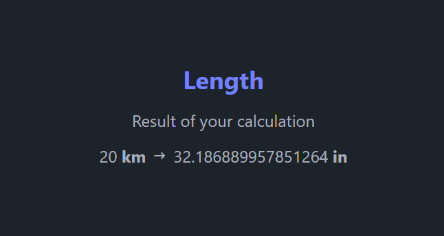
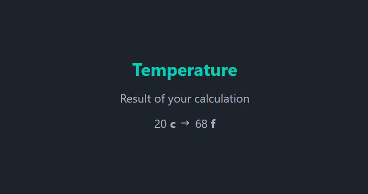

# Unit Converter

This is a simple unit converter application that allows you to convert length, weight, and temperature.

## Features

- Length conversion
- Weight conversion
- Temperature conversion

## Getting Started
1. Clone the repository:
   ```bash
   git clone https://github.com/angellisandroerazo/unit-converter.git
   ```

2. Navigate to the project directory:
   ```bash
   cd unit-converter
   ```

3. Run the application:
   ```bash
   go run main.go
   ```
   The application will be available at http://127.0.0.1:3000 or http://localhost:3000


## Screenshots

<div>
  
  
  
</div>
<div>
  
  
  
</div>

## Problem Statement
This project addresses a task management problem inspired by the challenges outlined in the [Unit Converter](https://roadmap.sh/projects/unit-converter).